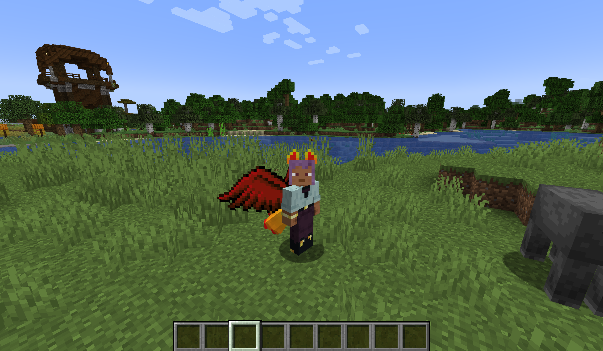
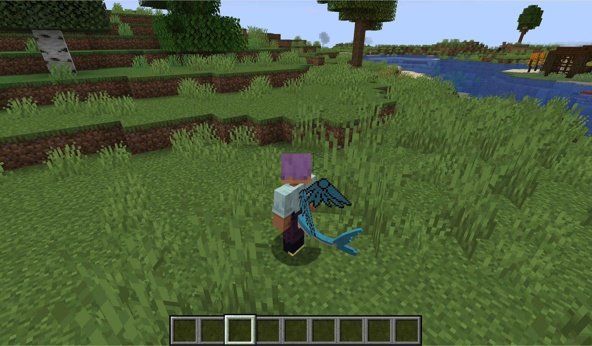
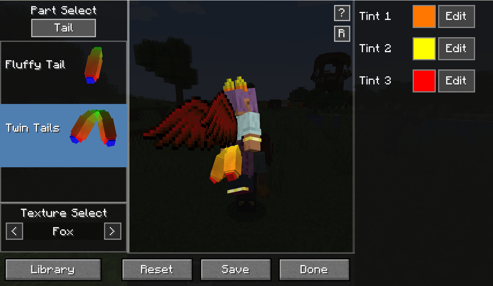
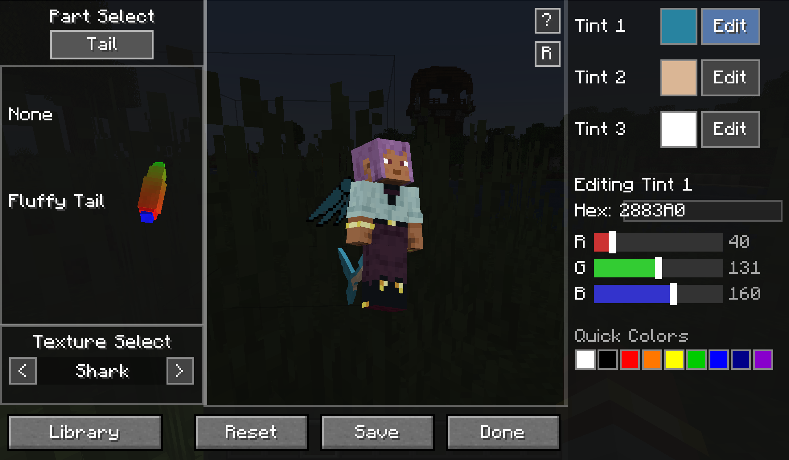

# Tails 1.20.1 Unofficial Port

Unofficial Minecraft Forge 1.20.1 port of **Tails** by **Kihira**.

This repository is intended to make the port reviewable in public and to provide a clean place for pull requests against the original project.

## Status

- Target loader: Minecraft Forge `1.20.1`
- Port status: playable work-in-progress
- Goal: preserve the original look and behavior of the editor, rendering, and customization flow as closely as possible

## Original Project

- Original author: **Kihira**
- Upstream repository: <https://github.com/kihira/Tails>
- Upstream CurseForge page: <https://www.curseforge.com/minecraft/mc-mods/tails>

## Important Disclaimer

This is an **unofficial port**.

- It is **not affiliated with, endorsed by, or published by Kihira**
- If an official modern version becomes available, users should prefer the official release
- This repository should clearly remain labeled as an unofficial port on GitHub, CurseForge, and release notes

## Planned Pull Request

The upstream repository currently exposes a `develop` branch, and the original README indicates that contributions are typically submitted there.

- Intended PR target repository: <https://github.com/kihira/Tails>
- Intended PR target branch: `develop`
- Your public fork URL: `https://github.com/AkashiroSku/Tails`
- Your working branch example: `forge-1.20.1-port`

## What This Port Includes

- Restored player part rendering flow for tails, ears, wings, and muzzle
- Generated tint texture handling for modern Forge
- GUI layout adjusted to resemble the original editor more closely
- Live preview updates while editing
- Localization cleanup
- Tail-specific gameplay bonuses

## Screenshots

### In-Game Showcase





### Editor Showcase





## Build

Use the standard Forge Gradle flow from the project root:

```bash
./gradlew build
```

On Windows:

```powershell
.\gradlew.bat build
```

## Public Repository Checklist

Before sharing this repo publicly, replace these placeholders:

- `https://github.com/AkashiroSku/Tails/tree/<forge-1.20.1-port>`
- `https://github.com/AkashiroSku/Tails/compare/<forge-1.20.1-port>`

Recommended repository description:

> Unofficial Minecraft Forge 1.20.1 port of Kihira's Tails mod.

## Suggested CurseForge Wording

> Original mod by Kihira. This is an unofficial Forge 1.20.1 port and is not affiliated with or endorsed by the original author. Source code and pull request are public on GitHub.

## License Note

The upstream GitHub repository and CurseForge project both present **MIT** licensing information. Before publishing releases from this port, verify that the repository metadata, packaged metadata, and release page all consistently reflect the intended license and attribution.
